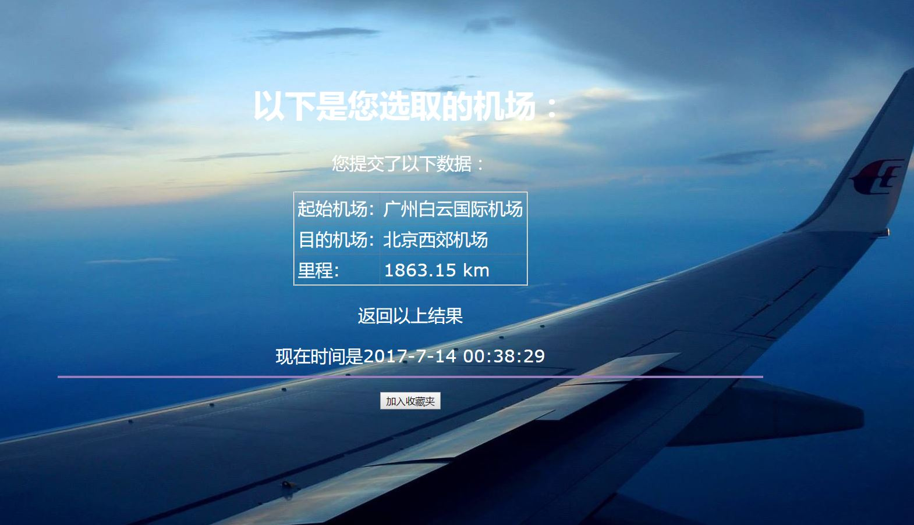

airportsweb

英文项目名称airportsweb,airports指两个机场,web意思为网页，就是指查询两个机场里程的一个网页

# 简介 
计算中国国内两个机场之间的里程，输入方面用户可输入机场名称中的任意一个字，（如：输入“广”，即可出现“广州白云国际机场”等，内含有“广”字的机场名称），即可挑选出国内所有机场中包含这个字的机场，输出方面则是输入方面中挑选出来的两个机场之间的里程，数据来源为[airports-codes.csv](https://github.com/datasets/airport-codes/tree/master/data)

## 输入：
用户输入国内两个机场名称，交互界面使用到HTML之[datalist](http://www.w3school.com.cn/tags/tag_select.asp)标签，显示的是机场名称，所以用户可以用 机场名称 的片段来找所需要的机场。详细见[templates/entry.html](https://github.com/SylviaTang/nfu_newmedia_python/blob/master/airportsweb/templates/entry.html)
## 输出：
用户得到输出结果为：起始机场，目的机场，里程共3项数据，见[templates/results.html](https://github.com/SylviaTang/nfu_newmedia_python/blob/master/airportsweb/templates/results.html)模版中table标签所包含的3项数据 导入了自定义get_distance 可输出机场距离
## 从输入到输出，除了flask模块，本组作品还使用了：
### 模块
* [json](http://www.json.org/)
* [os.path]( )
* [csv]( )
### 数据
* 数据来源：[世界机场数据](https://github.com/datasets/airport-codes/blob/master/data/airport-codes.csv) 非原创，取自github用户：Mikanebu  的[datasets/airport-codes/data/airport-codes.csv](https://github.com/datasets/airport-codes/blob/master/data)
* 数据清理：清除无用的数据，保留经纬度并由组员yaneziwaii翻译出机场名称
* 最终数据：[Airports_zh_code_geo.json](https://github.com/SylviaTang/nfu_newmedia_python/blob/master/airportsweb/data/Airports_zh_code_geo.json) 机场经纬度文件。最终数据的处理代码由[廖汉腾老师](https://github.com/hanteng)提供指导
* 资料类型：json
### API
无

## Web App动作描述

以下按web 请求（web request） - web 响应 时序说明

1. 後端伺服器启动：执行 [airportsweb.py](airportsweb.py) 启动後端伺服器，等待web 请求。启动成功应出现：  * Running on http://127.0.0.1:5000/ (Press CTRL+C to quit)

2. 前端浏览器web 请求：访问 http://127.0.0.1:5000/ 启动前端web 请求

3. 後端伺服器web 响应：[airportsweb.py](airportsweb.py) 中 执行 了@app.route('/') 下的 entry_page()函数，以HTML模版[templates/entry.html](templates/entry.html)及一个机场名称的字典（见代码 the_list_items = a_list）产出的产生《欢迎使用查询国内两个机场之间里程之工具》的HTML页面

4. 前端浏览器收到web 响应：出现HTML页面有HTML表单的变数名称(name)为'user_airportone'和'user_airporttwo'，使用了HTML的select，详见HTML模版[templates/entry.html](templates/entry.html)

5. 前端浏览器web 请求：用户选取指标後按了提交钮「查询」，则产生新的web 请求，按照form元素中定义的method='POST' action='/pickairport'，以POST为方法，动作为/pickairport的web 请求

6. 後端服务器收到用户web 请求，匹配到@app.route('/pickairport', methods=['POST'])的函数 searchairports() 

7. [airportsweb.py](airportsweb.py) 中 def searchairports() 函数，把用户提交的数据，以flask 模块request.form['user_airportone'],request.form['user_airporttwo']	取到Web 请求中，HTML表单变数名称airportone的值，存放在user_airportone这Python变数下以及airporttwo的值，存放在user_airporttwo这Python变数下。再使用flask模块render_template 函数以[templates/results.html](templates/results.html)模版为基础（输出），其中模版中the_airportone的值，用airportone这变数之值以及the_airporttwo的值，用airporttwo这变数之值。还有，results从TEST.py中函数get_distance获得，the_distance的值用results之值。

8. 前端浏览器收到web 响应：模版中[templates/results.html](templates/results.html) 的变数值正确的产生的话，前端浏览器会收到正确响应，看到指标的相关元数据。

## 作者成员：
见[_team_.tsv](_team_/_team_.tsv)

		zdnfzgb
		Kazeeeee
		ziziziz
		WordlessSoda
		JamieYin
		SylviaTang
		yaneziwaii

